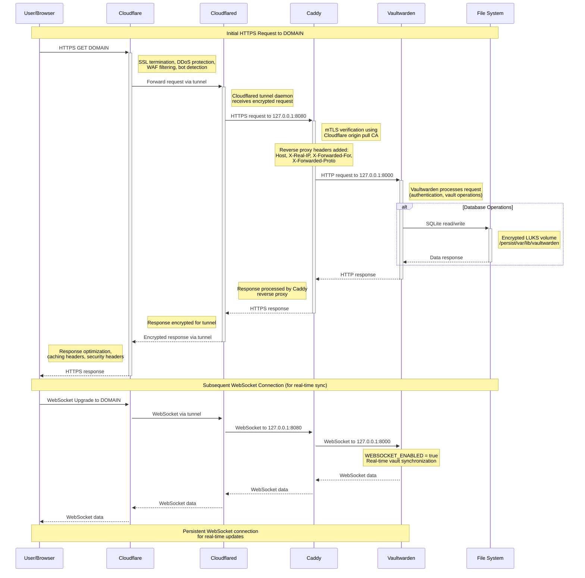

# Nordwand

Provide isolated, secure way to server passwords.

## Design doc

Goals:

- Run on local network, but compromise of the service should not compromise local network
  - Use Tailscale to create a isolated "VLAN" to which nothing can connect, and which cannot communicate to the outside.
- Use [Cloudflare Tunnel]() to make use of Cloudflares DDoS protection, etc.
- Make sure that HTTPS is used wherever possible
- Backup data
  - [ ] Still a Todo.

Non-goals:

- Run on VPS to avoid most security considerations

Intended sequence diagram:

